# Addax Admin

[](https://opensource.org/licenses/Apache-2.0)
[](https://openjdk.java.net/)
[](https://spring.io/projects/spring-boot)
[](https://vuejs.org/)

Addax Admin 是为 Addax ETL 引擎打造的一套现代化、企业级 ETL 管理与监控控制台。项目以 Monorepo 的形式组织，包含完整的后端 API 服务与前端管理界面，旨在提供从任务配置、调度执行、运行监控到日志审计的一站式运维体验。

核心目标：让数据工程师和运维人员更容易地管理 Addax 作业、观察运行状态、调优并发与重试策略，并在多节点部署下保证高可用与并发控制。

---

## 界面预览

以下为生产环境页面截图，帮助你快速了解界面与功能覆盖：

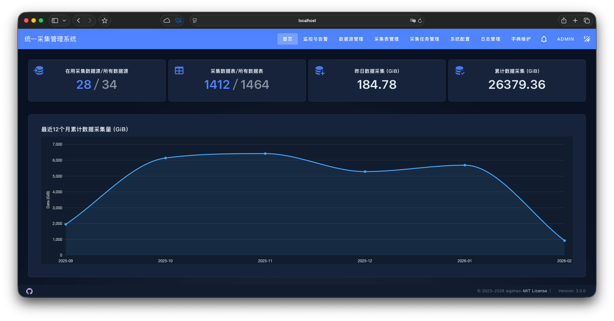
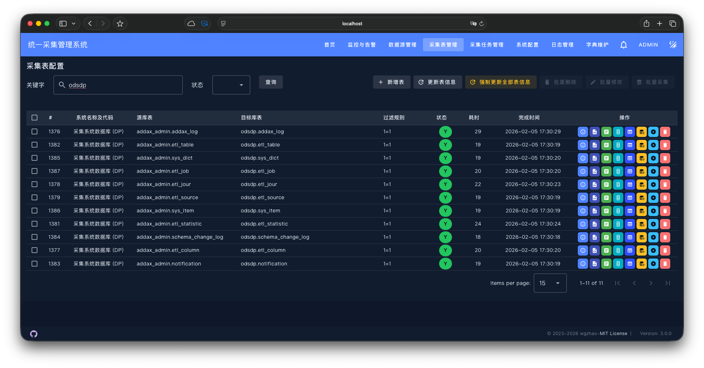
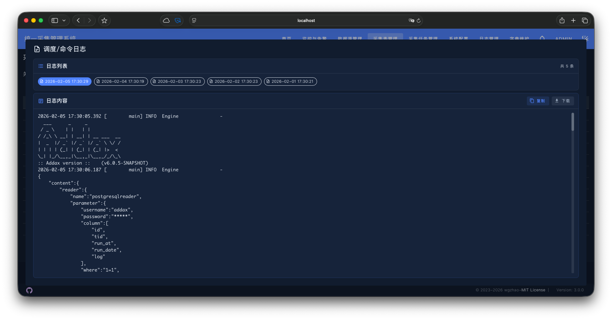
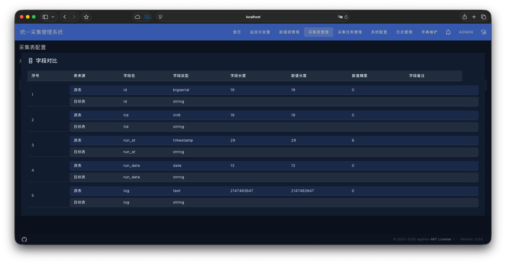
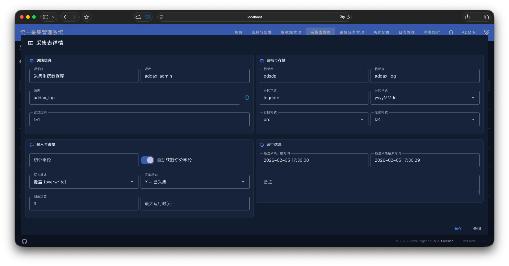
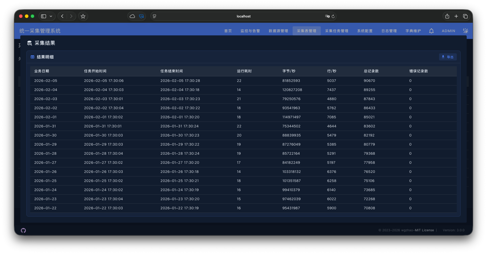
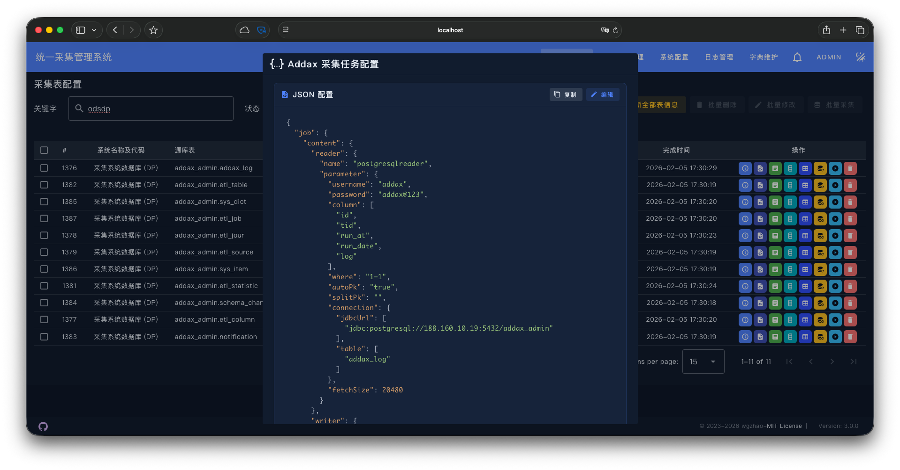
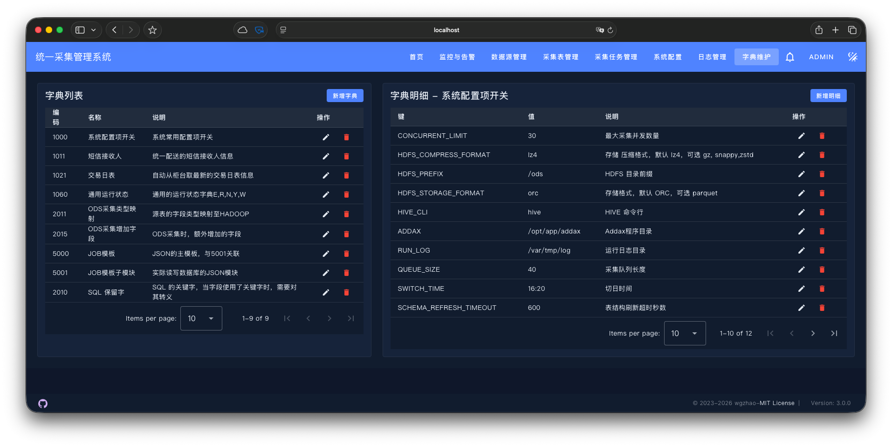
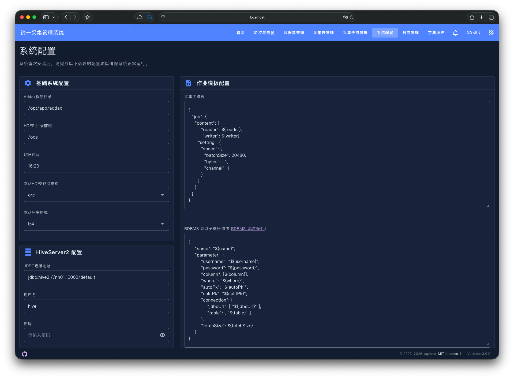

如果需要更多页面截图，可直接查看 [screenshots/](screenshots/)。

## 目录结构（简要）

```
addax-admin/
├── backend/                 # Spring Boot 3 后端服务（API、调度、持久化、Redis 仲裁）
├── frontend/                # Vue 3 + Vite + TypeScript + Vuetify 管理界面
├── scripts/                 # 部署与运维脚本（DB 初始化、systemd service 模板等）
└── README.md                # 本文档
```

## 主要组成

- Addax Admin Backend：Spring Boot 实现，负责任务持久化（Postgres）、分发逻辑、Redis 锁与仲裁、权限与 JWT、调度（cron/周期）等。
- Addax Admin Frontend：基于 Vue 3 + Vuetify 的单页应用，提供任务配置、ODS 表管理、日志查看、实时监控与告警配置。
- 数据库初始化：scripts/schema.sql 和 scripts/data.sql 提供数据库 schema 与默认数据。

---

## 亮点与特色

- 混合并发控制架构：DB 持久化队列 + Redis 仲裁（per-job 锁、全局/源级 permit），兼顾可靠性与性能。
- 快速批量创建采集表：在 UI 中只需点击几下即可批量新增数百到上千张采集表；并支持一键在目标存储（例如 Hive）中同步创建表与分区，显著提升大规模数据接入效率。
- 表结构演化支持：自动探测源端表结构变化（字段类型变更、新增/删除字段等），并可自动同步修改目标表结构；对有分区的表提供历史数据兼容策略，最大限度减少中断与人工干预。
- 动态表名采集：原生支持日表、月表等动态表名模板（例如 my_table_{yyyyMMdd}），自动解析时间规则并生成相应的采集任务，方便处理按时间切分的数据源。
- 增量采集与智能过滤：支持使用上一次采集结果（例如前一日最大 ID 或指定字段）作为本次增量采集的过滤条件；同时支持自定义过滤表达式，适合复杂增量场景。
- 多节点并发与权重：采用 sharing-nothing 架构与 Redis 仲裁，支持节点权重设定（node.concurrency.weight），实现全局/源级并发控制、任务高可用与负载均衡。
- 可视化管理：完整的任务配置、字段对比、实时执行进度与历史日志查询，提升运维效率。
- 企业级安全与可扩展性：JWT + Spring Security 做权限与认证，采用 Spring Data JPA 与模块化前端设计，方便定制与扩展。

---

## 🚀 快速开始（5 分钟部署）

### 容器模式

#### 1. 准备部署目录

```bash
# 创建项目目录
mkdir addax-admin && cd addax-admin

# 创建必要的子目录
mkdir -p scripts drivers job
```

#### 2. 下载必要文件

```bash
# 下载 docker-compose 配置文件
wget https://raw.githubusercontent.com/wgzhao/addax-admin/master/docker-compose.yml

# 下载数据库初始化脚本
wget -P scripts/ https://raw.githubusercontent.com/wgzhao/addax-admin/master/scripts/schema.sql
wget -P scripts/ https://raw.githubusercontent.com/wgzhao/addax-admin/master/scripts/data.sql
```

#### 3. 启动服务

```bash
# 启动所有服务
docker-compose -f docker-compose.yml up -d

# 查看服务状态
docker-compose -f docker-compose.yml ps

# 查看日志
docker-compose -f docker-compose.yml logs -f
```

#### 4. 访问应用

运行成功后，访问 <http://localhost:50080>，默认账号为 admin, 密码为 `admin123`

更多详细配置请参考 [DOCKER-USER-GUIDE.md](DOCKER-USER-GUIDE.md)

### 本地开发模式

先决条件

- Java 21
- Maven 3.8+
- Node.js >= 16.x
- Yarn（或 npm）
- PostgreSQL（建议 15+）、Redis（用于任务仲裁）

一键启动（推荐）

```bash
# 克隆项目并进入目录
git clone https://github.com/wgzhao/addax-admin.git
cd addax-admin

# 一键启动前后端开发环境
./start-dev.sh
```

若选择手动启动：

后端（开发）

```bash
# 1. 初始化数据库（在 PostgreSQL 中创建数据库 addax_admin）
psql -U postgres -d your_database -f backend/src/main/resources/schema.sql
psql -U postgres -d your_database -f backend/src/main/resources/data.sql

# 2. 运行后端服务
cd backend
mvn spring-boot:run
```

前端（开发）

```bash
cd frontend
yarn install
yarn dev
```

默认访问地址（开发）

- 前端（Vite dev server）：<http://localhost:3030>
- 后端 API（Spring Boot）：<http://localhost:50601/api/v1>

生产构建与运行

后端打包并运行：

```bash
mvn clean package
java -jar backend/target/addax-admin-<version>.jar
```

前端构建并静态部署：

```bash
yarn build
```

建议在生产环境使用 docker + docker-compose 将 Postgres / Redis / 后端 / 前端（静态）组合部署。

---

配置（环境变量）

后端配置位于：backend/src/main/resources/application.properties
可以通过环境变量覆盖（示例：backend/config/env.template.sh）

重要环境变量（后端）：

- DB_HOST, DB_PORT, DB_NAME, DB_USERNAME, DB_PASSWORD
- REDIS_HOST, REDIS_PORT, REDIS_PASSWORD, REDIS_DB
- LOG_DIR（默认 ./logs）
- node.concurrency.weight（调度权重）
- WECOM_ROBOT_KEY（企业微信机器人，用于告警）

前端环境变量（vite）

- VITE_API_BASE_URL（如 /api 或 /api/v1）
- VITE_API_HOST（后端地址，例如 <http://localhost:50601）>

文档链接

- 功能详解（含批量创建、schema 变更、动态表、增量过滤、多节点并发等）：docs/FEATURES.md
- 示例与模板：docs/examples/

---

数据库与迁移

项目自带初始化脚本：

- scripts/schema.sql（表结构与索引）
- scripts/data.sql（初始数据）

如果你在生产环境部署，建议：

- 在单独的数据库实例创建专用用户与数据库
- 使用备份与版本化迁移工具（Flyway / Liquibase）管理 schema 变更

---

调度与并发控制机制概览

核心思路：保留数据库持久化语义（任务队列、审计、重试），用 Redis 做实时仲裁以避免数据库争用并支持低延迟并发限制。

- 每个任务在 DB 持久化为 etl_job_queue，节点领取任务时会获取 Redis per-job 独占锁以及 permit（全局或源级）。
- Redis 锁使用 SETNX + TTL 并通过 Lua 脚本释放以保证 token 匹配。
- 执行中节点会周期性续租锁与 permit，完成后释放资源并更新 DB 状态。

充分利用此机制可以在多实例部署下保证高可用与并发可控。

### 数据表采集流程图

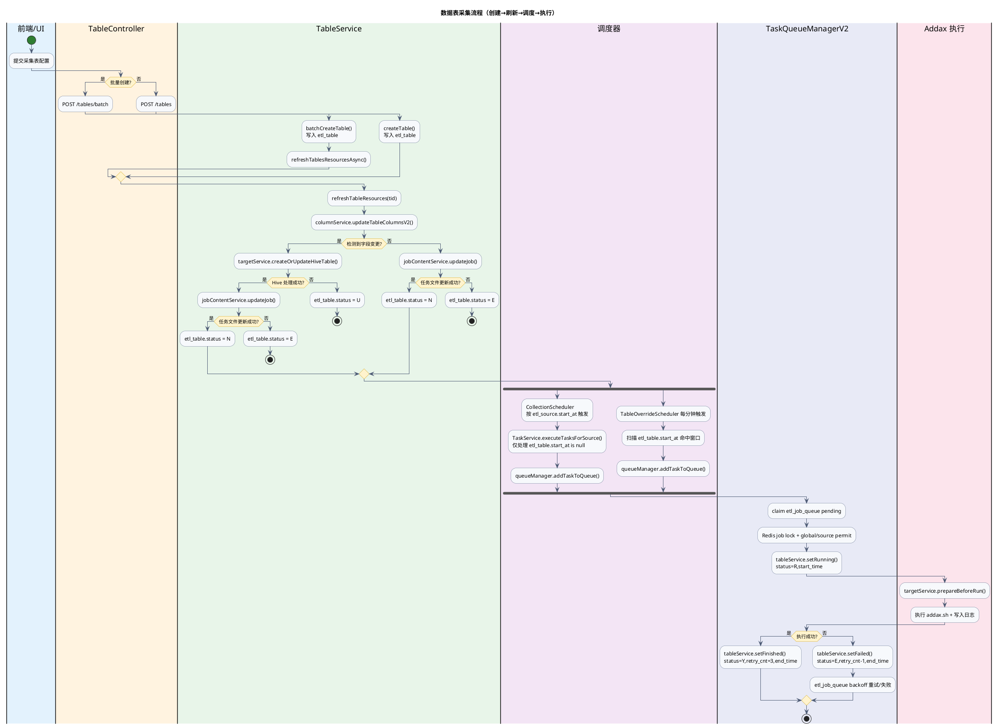

如果上图没有渲染，可以参考  查看高清版本。

---

日志与监控

- 默认日志目录：./logs（可通过 LOG_DIR 覆盖）
- 后端日志配置：backend/src/main/resources/logback-spring.xml
- 建议在生产通过日志聚合（ELK / Loki）和监控（Prometheus + Grafana）汇总指标与告警

---

常见故障排查

- 应用无法连接数据库：检查 DB_* 环境变量与 schema.sql 是否已应用
- Redis 连接失败：确认 spring.data.redis.* 环境变量与网络可达
- JWT 认证错误：检查后端 JwtService 配置（jwt.expiration、密钥等）
- 前端 API 跨域或代理异常：检查 VITE_API_BASE_URL 与 vite.config.ts 的 proxy 配置
- 端口冲突：默认前端 3030，后端 50601，请确认端口未被占用

---

开发者与贡献指南

欢迎贡献！建议流程：

1. Fork && 新建分支（feature/xxx 或 fix/xxx）
2. 本地开发并保证 lint / type check 通过
3. 提交并发起 Pull Request，描述变更理由和回归测试步骤

---

许可证

本项目基于 Apache License 2.0（详见 LICENSE 文件）。
